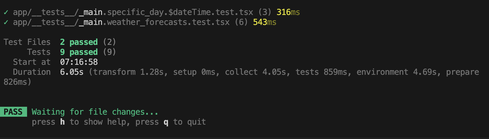

## 概要

- 場所を入力することで、その場所の現在の天気、予報天気が取得できるアプリです。
- [デプロイ先](https://weather-app-used-remix.vercel.app/weather_forecasts)
- 作成に要した時間：約12時間15分(仕様確認、ESLint等の開発における設定、テスト実装、READEME記載等を含む)
- （なお、予報取得箇所については[weatherapi](https://www.weatherapi.com/docs/)のお試し期間が終了し、freeプランに移行したため、現在は3日分のみの取得となります。）

## ローカル環境での動作確認及びテスト実行

### ローカル環境での動作

- 今回は天気情報取得するに当たり、[weatherapi](https://www.weatherapi.com/docs/)を使用しています。
- そのため、weatherapiに無料登録の上、ルートに`.env`ファイルを作成して、API KEYを設定する必要があります（`.env.example`を参考）。
- 上記手順を踏んだうえで、以下を実行します。

  ```bash
  $ npm i # 依存関係インストール。最初のみ。
  $ npm run dev # ローカル環境での起動
  ```

### テスト実行

- 実行コマンド
  ```bash
  $ npm run test
  ```
- (参考:テスト結果)
  

## 使用技術

### 指定技術に関するもの

- フレームワーク: Reactのフレームワークとして、[Remix](https://remix.run/)を使用しています。
- テスト: [Vitest](https://vitest.dev/), [Testing Library](https://testing-library.com/)
  - Testing Library自体の使用は多少ありますが、Remix内での使用は初めてとなります。
  - また、Vitestについても初めてですが、[Jest](https://jestjs.io/ja/)の使用については経験がございます。
  - なお、今回外部APIを使用することから、当初は[RemixのcreateRemixStub](https://remix.run/docs/en/main/utils/create-remix-stub)でレスポンスをMock化し、ページ単位で統合テスト記載する方針を考えていました。
  - しかし、調査等時間がかかったため、ページ内の主要コンポーネントに対し、統合テストを記載することで、代用しています。

### 個別に追加したライブラリ等

- 本実装では基本的にRemix作成時に自動で導入されるものやテスト、ESLintに関するものを除き、極力ライブラリを導入せず、自力で実装しています。
- ただし、Vercelにデプロイするにあたり、[@vercel/remix](https://vercel.com/docs/frameworks/remix#@vercel/remix)のみ追加で導入しています。

## LLMの使用と有効性に関して

- 今回、外部APIを使用しましたが、レスポンスの型定義、テスト用のMock値に関して、Chat GPT(GPT-4)やGitHub Copilotを使用しています。
  - 例えば、wetherapiのドキュメントを一部読み込ませて、型定義を作成するなどしています。
- 多少、間違えることはありましたが、概ね問題なく定義されており、今回のような外部APIをもとに型定義する必要がある場合は大いに活用できるという所感です。
